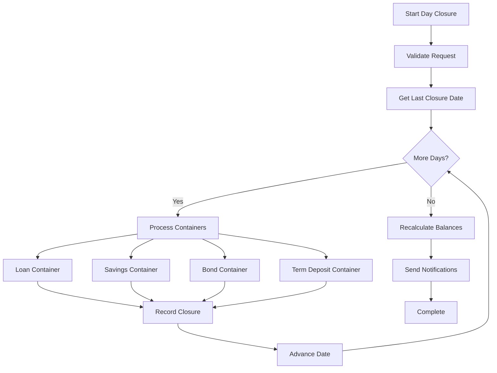

## Overview

The Day Closure process is a critical end-of-day operation in OpenCBS Cloud that performs financial calculations, interest accruals, penalty computations, automated repayments, and generates analytical data. It ensures accurate financial reporting and maintains data integrity across all modules.

## What is Day Closure?

Day Closure is an automated workflow that:

- Accrues interest on loans, savings, and term deposits
- Calculates and applies penalties for overdue loans
- Processes automated repayments
- Updates account balances and aging buckets
- Generates accounting entries
- Recalculates analytics and reports
- Advances the operational date

<Warning>
  Day Closure is an irreversible operation. Once executed, the system operational date advances and historical corrections require careful handling.
</Warning>

## Architecture

### Core Components

The day closure system is implemented across multiple services:

<CardGroup cols={2}>
  <Card title="DayClosureProcessWorker" icon="gears">
    Main orchestrator that coordinates the entire day closure workflow.
    
    **Location:** `com.opencbs.core.dayclosure.DayClosureProcessWorker`
  </Card>

  <Card title="DayClosureController" icon="server">
    REST API endpoint for initiating and monitoring day closure.
    
    **Endpoint:** `/api/day-closure`
  </Card>

  <Card title="Containers" icon="box">
    Module-specific processors for loans, savings, bonds, etc.
    
    **Interface:** `com.opencbs.core.services.operationdayservices.Container`
  </Card>

  <Card title="DayClosureService" icon="database">
    Persistence layer for day closure records and history.
    
    **Service:** `com.opencbs.core.services.DayClosureService`
  </Card>
</CardGroup>

### Process Flow



## Initiating Day Closure

### Manual Execution

<Steps>
  <Step title="Ensure Prerequisites">
    Before starting day closure:
    - All daily transactions are posted
    - Till reconciliation is complete
    - No users are performing critical operations
    - Backup is completed
  </Step>

  <Step title="Submit Day Closure Request">
    ```bash
    POST /api/day-closure?date=2024-01-15T23:59:59
    Authorization: Bearer {token}
    ```
    
    **Required Permission:** `DAY_CLOSURE` (Module: `DAY_CLOSURE`)
    
    Response:
    ```json
    {
      "message": "Day Closure has started"
    }
    ```
  </Step>

  <Step title="Monitor Progress">
    ```bash
    GET /api/day-closure/status
    ```
    
    Response:
    ```json
    {
      "status": "IN_PROGRESS",
      "leftDays": 0,
      "processes": {
        "LOANS": {
          "order": 1,
          "title": "Loan Processing",
          "progress": 75,
          "status": "IN_PROGRESS"
        },
        "SAVINGS": {
          "order": 2,
          "title": "Savings Processing",
          "progress": 0,
          "status": "DONE"
        }
      }
    }
    ```
  </Step>

  <Step title="Completion">
    When complete, status changes to `DONE` and notifications are sent to the initiating user.
  </Step>
</Steps>

### Automated Day Closure

Configure automatic day closure execution:

```properties
# application.properties

# Enable automatic day closure
day-closure.auto-start=true

# Cron expression for scheduling (default: 2:00 AM daily)
day-closure.auto-start-time=0 0 2 * * *

# Email addresses to notify on errors
day-closure.error-to-emails=admin@example.com,finance@example.com
```

The scheduled execution is implemented using Spring's `@Scheduled` annotation:

```java
@Scheduled(cron="${day-closure.auto-start-time}")
public void autoStart() {
    if(this.dayClosureProperties.getAutoStart()) {
        this.dayClosure(DateHelper.getLocalDateNow(), UserHelper.getSystemUser());
    }
}
```

<Note>
  Automatic day closure runs as the system user and requires no manual intervention unless errors occur.
</Note>

## Day Closure Workflow

### Implementation Details

The main processing method in `DayClosureProcessWorker`:

```java
@Async
public void processDayClosure(LocalDate launchDate, User user) {
    this.status = ProcessStatus.IN_PROGRESS;
    LocalDate dayClosureDate = getLastDayClosureDate(user);
    final LocalDateTime startTime = DateHelper.getLocalDateTimeNow();
    
    try {
        log.info("Day closure was started from {} to {}", 
            DateHelper.convert(dayClosureDate), 
            DateHelper.convert(launchDate));
        
        // Process each day from last closure to target date
        while (lessOrEqual(dayClosureDate, launchDate)) {
            log.info("DayClosureProcessor day closure for date {} start", 
                DateHelper.convert(dayClosureDate));
            
            setLeftDays(dayClosureDate, launchDate);
            
            // Process all containers for this day
            for (Container container : containers) {
                long startTimeContainer = System.currentTimeMillis();
                processContainer(container, dayClosureDate, user);
                log.info("Container {} finish, it took {} seconds",
                    container.getType().toString(), 
                    (System.currentTimeMillis() - startTimeContainer) / 1000);
            }
            
            // Record successful day closure
            dayClosureService.createDayClosure(dayClosureDate, startTime, 
                DateHelper.getLocalDateTimeNow(),
                LocalDateTime.of(launchDate, startTime.toLocalTime()), 
                null, user.getBranch());
            
            // Move to next day
            dayClosureDate = dayClosureDate.plusDays(1);
        }
        
        // Recalculate balances for back-dated transactions
        log.info("Recalculate of balances for back-date transactions start");
        this.recalculateBalanceService.recalculateBalances();
        log.info("Recalculate of balances for back-date transactions end");
        
        this.amqNotice(user);
        log.info("Day closure was successful done");
        
    } catch (Exception e) {
        log.error("Day closure was done with error: {}", e.getMessage());
        dayClosureService.createDayClosure(dayClosureDate, startTime, 
            DateHelper.getLocalDateTimeNow(),
            LocalDateTime.of(launchDate, startTime.toLocalTime()), 
            e.getMessage(), user.getBranch());
        amqMessageHelper.sendSystemMessage(SystemMessageType.ERROR, 
            String.format("Day closure was done with error: %s", e.getMessage()));
        this.sendDayClosureError(this.dayClosureProperties.getErrorToEmails(), 
            dayClosureDate, e);
    } finally {
        status = ProcessStatus.DONE;
    }
}
```

### Container Processing

Each container represents a module (Loans, Savings, Bonds, etc.) and processes contracts in parallel:

```java
private void processContainer(@NonNull Container container, 
                              @NonNull LocalDate dayClosureDate, 
                              @NonNull User user) {
    // Get all contract IDs for this container and branch
    List<Long> contractIds = container.getIdsContracts(user.getBranch());
    
    // Partition contracts into batches of 100
    List<List<Long>> contractPartitions = ListUtils.partition(contractIds, 100);
    
    // Process each partition asynchronously
    List<Future<Void>> futures = contractPartitions.stream().map(
        x -> {
            DayClosureContainerExecutor closureService = 
                applicationContext.getBean(DayClosureContainerExecutor.class);
            return closureService.processContainerContracts(
                container, x, dayClosureDate, user);
        }
    ).collect(Collectors.toList());
    
    // Wait for all partitions to complete
    waitContainerExecutionComplete(futures, container, user);
}
```

### Module-Specific Containers

<AccordionGroup>
  <Accordion title="Loan Container">
    **Responsibilities:**
    - Accrue interest on outstanding principal
    - Calculate and apply late payment penalties
    - Update loan aging buckets
    - Process automatic repayments
    - Generate interest accrual accounting entries
    
    **Example:** `LoanContainer` processes all active loan accounts
  </Accordion>

  <Accordion title="Savings Container">
    **Responsibilities:**
    - Calculate interest on savings balances
    - Apply interest to accounts
    - Process maturity dates
    - Generate interest accounting entries
    
    **Example:** `SavingsContainer` processes all savings accounts
  </Accordion>

  <Accordion title="Bond Container">
    **Responsibilities:**
    - Accrue bond interest
    - Update bond installment schedules
    - Calculate and post interest entries
    - Handle bond maturity
    
    **Implementation:** `BondDayClosureProcessor`
    
    Example from code:
    ```java
    public class BondDayClosureProcessor {
        public void processBondAccrual(Bond bond, LocalDate date) {
            // Calculate interest accrual
            BigDecimal accrualAmount = calculateAccrual(bond, date);
            
            // Create accrual record
            BondInterestAccrual accrual = new BondInterestAccrual();
            accrual.setBond(bond);
            accrual.setAccrualDate(date);
            accrual.setAmount(accrualAmount);
            
            // Post accounting entries
            postAccrualEntries(bond, accrualAmount, date);
        }
    }
    ```
  </Accordion>

  <Accordion title="Term Deposit Container">
    **Responsibilities:**
    - Accrue interest on term deposits
    - Handle maturity and renewals
    - Process early closures
    - Generate accounting entries
  </Accordion>

  <Accordion title="Borrowing Container">
    **Responsibilities:**
    - Accrue interest on borrowings
    - Calculate payment obligations
    - Update borrowing schedules
    - Post accounting entries
  </Accordion>
</AccordionGroup>

## Day Closure Validation

The `DayClosureValidator` ensures prerequisites are met:

```java
public class DayClosureValidator {
    public void validateTryCloseDay(LocalDate launchDate, 
                                   ProcessStatus status, 
                                   User user) {
        // Check if day closure is already running
        if (status == ProcessStatus.IN_PROGRESS) {
            throw new RuntimeException("Day closure is already in progress");
        }
        
        // Validate user has permission
        if (!user.hasPermission("DAY_CLOSURE")) {
            throw new RuntimeException("User does not have day closure permission");
        }
        
        // Validate target date is not in the future
        if (launchDate.isAfter(DateHelper.getLocalDateNow())) {
            throw new RuntimeException("Cannot close future dates");
        }
        
        // Additional validations...
    }
}
```

## Initial Configuration

Before running day closure for the first time, set the initial date in Global Settings:

```sql
INSERT INTO global_settings (name, type, value)
VALUES ('DAY_CLOSURE_INIT_DATE', 'DATE', '2024-01-01');
```

This setting is referenced in the code:

```java
private LocalDate getLastDayClosureDate(User user) {
    return dayClosureService.getLastSuccessfulDayClosureByBranch(user.getBranch())
        .map(dc -> dc.getDay().plusDays(1))
        .orElse(DateHelper.dateToLocalDateTime(
            DateHelper.convert(globalSettingsService.getSettingValue(
                "DAY_CLOSURE_INIT_DATE"))
        ).toLocalDate());
}
```

## Monitoring and Notifications

### Real-Time Status Updates

Day closure progress is broadcast via RabbitMQ:

```java
private void sendProcessStatusMessage(User user, Container container, int percentage) {
    DayClosureStateDto dayClosureStateDto = DayClosureStateDto.builder()
        .processes(Collections.singletonMap(container.getType(),
            ProcessDto.builder()
                .progress(percentage)
                .title(container.getTitle())
                .status(ProcessStatus.IN_PROGRESS)
                .build())
        )
        .leftDays(leftDays)
        .build();
    
    this.amqMessageHelper.sendMessageToUser(user, MessageDto.builder()
        .messageType(MessageType.DAY_CLOSURE)
        .payload(dayClosureStateDto)
        .build()
    );
}
```

### Email Notifications

Error notifications are sent via email:

```java
public void sendDayClosureError(Collection<String> emails, 
                                LocalDate localDate, 
                                Exception exception) {
    Map<String, Object> variables = new HashMap();
    variables.put("instance", instanceInformation.getInfo());
    variables.put("message", exception.getMessage());
    variables.put("trace", ExceptionUtils.getStackTrace(exception));
    variables.put("date", DateHelper.convert(localDate));
    
    this.emailService.sendEmail(emails, "Day closure error",
        TemplateGenerator.getContent("day_closure_error.html", variables));
}
```

## Multi-Day Closure

The system supports closing multiple days at once (e.g., after a holiday or system downtime):

```bash
POST /api/day-closure?date=2024-01-20T23:59:59
```

If the last closure was on January 15, the system will automatically process:
- January 16
- January 17
- January 18
- January 19
- January 20

Each day is processed sequentially to ensure accurate accruals and calculations.

## Balance Recalculation

After processing all days, the system recalculates account balances to handle back-dated transactions:

```java
log.info("Recalculate of balances for back-date transactions start");
this.recalculateBalanceService.recalculateBalances();
log.info("Recalculate of balances for back-date transactions end");
```

This ensures that any transactions posted with dates before the closure date are properly reflected in account balances.

## Performance Optimization

### Parallel Processing

Contracts are processed in parallel batches:

- Contracts divided into batches of 100
- Each batch processed by separate thread
- Progress tracked and reported in real-time
- Failures in one batch don't affect others

### Async Execution

Day closure runs asynchronously using Spring's task executor:

```java
@Async
public void processDayClosure(LocalDate launchDate, User user) {
    // Day closure implementation
}
```

Configured in `TaskExecutorConfig`:

```java
@Configuration
public class TaskExecutorConfig {
    @Bean(name = "taskExecutor")
    public Executor taskExecutor() {
        ThreadPoolTaskExecutor executor = new ThreadPoolTaskExecutor();
        executor.setCorePoolSize(10);
        executor.setMaxPoolSize(20);
        executor.setQueueCapacity(100);
        return executor;
    }
}
```

## Troubleshooting

<AccordionGroup>
  <Accordion title="Day Closure Hangs or Times Out">
    **Symptoms:**
    - Status remains IN_PROGRESS for extended period
    - No progress updates
    - System appears frozen
    
    **Causes:**
    - Large volume of contracts to process
    - Database performance issues
    - Deadlocks in parallel processing
    
    **Solutions:**
    1. Check application logs for errors
    2. Verify database connection pool isn't exhausted
    3. Monitor database performance and locks
    4. Consider increasing thread pool size
    5. Process fewer contracts per batch
  </Accordion>

  <Accordion title="Day Closure Fails with Error">
    **Symptoms:**
    - Status changes to DONE but with error message
    - Email notification received
    - Some modules processed, others not
    
    **Causes:**
    - Data inconsistencies
    - Validation failures
    - Accounting configuration errors
    - Database constraints violated
    
    **Solutions:**
    1. Check day closure error log in database
    2. Review email notification for stack trace
    3. Identify which container failed
    4. Fix data issues
    5. Restart day closure from last successful date
  </Accordion>

  <Accordion title="Cannot Start Day Closure">
    **Symptoms:**
    - API returns validation error
    - "Day closure is already in progress" message
    
    **Causes:**
    - Previous day closure still running
    - System crash left status as IN_PROGRESS
    - Missing DAY_CLOSURE permission
    
    **Solutions:**
    1. Check actual process status via `/api/day-closure/status`
    2. If stuck, manually reset status in database (with caution)
    3. Verify user has DAY_CLOSURE permission
    4. Check application is running
  </Accordion>

  <Accordion title="Incorrect Interest Calculations">
    **Symptoms:**
    - Interest amounts don't match expectations
    - Penalties not applied correctly
    - Accounting entries incorrect
    
    **Causes:**
    - Incorrect product configuration
    - Wrong day count method
    - Timezone issues
    - Missing accrual days
    
    **Solutions:**
    1. Review product interest configuration
    2. Verify day closure ran for all dates
    3. Check system timezone settings
    4. Manually recalculate sample account
    5. Compare with expected results
  </Accordion>
</AccordionGroup>

## Best Practices

<CardGroup cols={2}>
  <Card title="Timing" icon="clock">
    - Schedule during off-hours (2-4 AM)
    - Avoid peak transaction times
    - Allow sufficient time for completion
    - Plan for multi-day catches after holidays
  </Card>

  <Card title="Preparation" icon="list-check">
    - Complete all daily transactions first
    - Reconcile tills and vaults
    - Verify no active batch operations
    - Back up database before closure
  </Card>

  <Card title="Monitoring" icon="gauge">
    - Monitor progress via status endpoint
    - Watch application logs in real-time
    - Check database performance
    - Verify email notifications configured
  </Card>

  <Card title="Error Handling" icon="triangle-exclamation">
    - Set up proper error notification emails
    - Document error resolution procedures
    - Test day closure in staging regularly
    - Keep audit trail of all closures
  </Card>
</CardGroup>

## Day Closure Audit

All day closure operations are logged and auditable:

```sql
SELECT 
    id,
    day,
    start_time,
    end_time,
    branch_id,
    error_message,
    created_by_id
FROM day_closures
ORDER BY day DESC
LIMIT 30;
```

This provides a complete history of:
- When each day was closed
- How long it took
- Which user initiated it
- Whether errors occurred
- Which branch it was for

## Related Resources

- [System Configuration](/admin/configuration)
- [Accounting Entries API](/api/accounting/entries)
- [Loan Management](/guides/loan-management)
- [Accounting Guide](/guides/accounting)