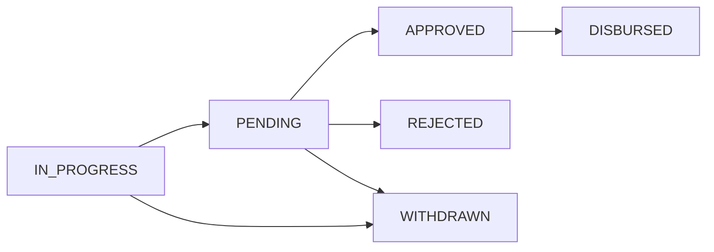

## Overview

Loan Applications represent requests for credit from borrowers. The application process includes:

- Creating applications with borrower and loan details
- Generating and previewing repayment schedules
- Managing guarantors, collateral, and payees
- Processing through credit committee approval
- Disbursing approved loans to borrower accounts

Applications follow a status-based workflow from initial creation through approval and disbursement.

## Application Status Flow



- **IN_PROGRESS**: Application being created/edited
- **PENDING**: Submitted for credit committee review
- **APPROVED**: Approved by credit committee
- **REJECTED**: Rejected by credit committee
- **WITHDRAWN**: Cancelled by applicant
- **DISBURSED**: Loan successfully disbursed

## Endpoints

### Create Loan Application

<CodeGroup>
```bash cURL
curl -X POST "https://your-instance.opencbs.com/api/loan-applications" \
  -H "Authorization: Bearer YOUR_ACCESS_TOKEN" \
  -H "Content-Type: application/json" \
  -d '{
    "profileId": 123,
    "loanProductId": 1,
    "amounts": [
      {
        "amount": 10000.00
      }
    ],
    "disbursementDate": "2024-04-01",
    "preferredRepaymentDate": "2024-04-15",
    "maturity": 12,
    "gracePeriod": 1,
    "currencyId": 1,
    "scheduleType": "ANNUITY",
    "interestRate": 12.00,
    "userId": 5
  }'
```

```javascript JavaScript
const response = await fetch(
  'https://your-instance.opencbs.com/api/loan-applications',
  {
    method: 'POST',
    headers: {
      'Authorization': 'Bearer YOUR_ACCESS_TOKEN',
      'Content-Type': 'application/json'
    },
    body: JSON.stringify({
      profileId: 123,
      loanProductId: 1,
      amounts: [{ amount: 10000.00 }],
      disbursementDate: '2024-04-01',
      preferredRepaymentDate: '2024-04-15',
      maturity: 12,
      gracePeriod: 1,
      currencyId: 1,
      scheduleType: 'ANNUITY',
      interestRate: 12.00,
      userId: 5
    })
  }
);
const application = await response.json();
```

```python Python
import requests

response = requests.post(
    'https://your-instance.opencbs.com/api/loan-applications',
    headers={'Authorization': 'Bearer YOUR_ACCESS_TOKEN'},
    json={
        'profileId': 123,
        'loanProductId': 1,
        'amounts': [{'amount': 10000.00}],
        'disbursementDate': '2024-04-01',
        'preferredRepaymentDate': '2024-04-15',
        'maturity': 12,
        'gracePeriod': 1,
        'currencyId': 1,
        'scheduleType': 'ANNUITY',
        'interestRate': 12.00,
        'userId': 5
    }
)
application = response.json()
```
</CodeGroup>

```
POST /api/loan-applications
```

Create a new loan application. The application is created in `IN_PROGRESS` status and can be edited before submission.

**Permission Required**: `CREATE_LOAN_APPLICATION`

#### Request Body

<ParamField body="profileId" type="integer" required>
  ID of the borrower profile (person, company, or group)
</ParamField>

<ParamField body="loanProductId" type="integer" required>
  ID of the loan product to use
</ParamField>

<ParamField body="amounts" type="array" required>
  Array of loan amounts. For individual loans, array contains one object. For group loans, contains one object per member.
  
  <Expandable title="GroupMemberAmountsDto">
    <ParamField body="amount" type="decimal" required>
      Loan amount requested
    </ParamField>
    
    <ParamField body="memberId" type="integer">
      Group member ID (required for group loans only)
    </ParamField>
  </Expandable>
</ParamField>

<ParamField body="disbursementDate" type="date" required>
  Planned disbursement date (ISO 8601 format: YYYY-MM-DD)
</ParamField>

<ParamField body="preferredRepaymentDate" type="date" required>
  Date when borrower prefers to make repayments each period
</ParamField>

<ParamField body="maturity" type="integer" required>
  Loan maturity in schedule periods (must be within product's min/max range)
</ParamField>

<ParamField body="gracePeriod" type="integer" required>
  Grace period in schedule periods (must be within product's min/max range)
</ParamField>

<ParamField body="currencyId" type="integer" required>
  Currency ID (must match loan product currency)
</ParamField>

<ParamField body="scheduleType" type="string" required>
  Schedule generation type:
  - `ANNUITY`: Equal installments
  - `ANNUITY_MONTHLY`: Monthly annuity payments
  - `ANNUITY_QUARTERLY`: Quarterly annuity payments
  - `EQUAL_INSTALLMENTS`: Equal principal with declining interest
  - `DECLINING_BALANCE`: Custom declining balance
  - `FLAT`: Flat interest method
</ParamField>

<ParamField body="interestRate" type="decimal" required>
  Annual interest rate as percentage (must be within product's min/max range)
</ParamField>

<ParamField body="userId" type="integer" required>
  ID of the loan officer managing this application
</ParamField>

<ParamField body="maturityDate" type="date">
  Final repayment date (calculated if not provided)
</ParamField>

<ParamField body="scheduleBasedType" type="string">
  Override schedule basis: `DAYS`, `WEEKS`, `MONTHS`, `YEARS` (defaults to product setting)
</ParamField>

<ParamField body="payees" type="array">
  Array of payee configurations (if product supports payees)
</ParamField>

<ParamField body="entryFees" type="array">
  Array of entry fee overrides
</ParamField>

<ParamField body="fieldValues" type="array">
  Array of custom field values
</ParamField>

<ParamField body="penaltyIds" type="array">
  Array of penalty IDs to apply to this loan
</ParamField>

<ParamField body="creditLineId" type="integer">
  Credit line ID if using pre-approved credit line
</ParamField>

#### Response

Returns the created `LoanApplicationDto` with generated schedule.

<Expandable title="Response Schema">
  <ResponseField name="id" type="integer">
    Application ID
  </ResponseField>
  
  <ResponseField name="code" type="string">
    Unique application code
  </ResponseField>
  
  <ResponseField name="status" type="string">
    Application status (will be `IN_PROGRESS`)
  </ResponseField>
  
  <ResponseField name="profile" type="object">
    Borrower profile details
  </ResponseField>
  
  <ResponseField name="loanProduct" type="object">
    Loan product details
  </ResponseField>
  
  <ResponseField name="loanOfficer" type="object">
    Loan officer details
  </ResponseField>
  
  <ResponseField name="amounts" type="array">
    Loan amounts by member (for group loans)
  </ResponseField>
  
  <ResponseField name="interestRate" type="decimal">
    Annual interest rate
  </ResponseField>
  
  <ResponseField name="maturity" type="integer">
    Loan maturity in periods
  </ResponseField>
  
  <ResponseField name="gracePeriod" type="integer">
    Grace period in periods
  </ResponseField>
  
  <ResponseField name="disbursementDate" type="string">
    Planned disbursement date
  </ResponseField>
  
  <ResponseField name="preferredRepaymentDate" type="string">
    Preferred repayment date
  </ResponseField>
  
  <ResponseField name="maturityDate" type="string">
    Final repayment date
  </ResponseField>
  
  <ResponseField name="scheduleType" type="string">
    Schedule generation method
  </ResponseField>
  
  <ResponseField name="installments" type="object">
    Generated repayment schedule
  </ResponseField>
  
  <ResponseField name="createdAt" type="string">
    Creation timestamp
  </ResponseField>
  
  <ResponseField name="createdBy" type="object">
    User who created the application
  </ResponseField>
  
  <ResponseField name="currencyId" type="integer">
    Currency ID
  </ResponseField>
  
  <ResponseField name="currencyName" type="string">
    Currency name
  </ResponseField>
  
  <ResponseField name="isReadOnly" type="boolean">
    Whether application can be edited
  </ResponseField>
</Expandable>

<CodeGroup>
```json 201 Response
{
  "id": 456,
  "code": "LA-2024-00456",
  "status": "IN_PROGRESS",
  "profile": {
    "id": 123,
    "name": "John Smith",
    "type": "PERSON"
  },
  "loanProduct": {
    "id": 1,
    "name": "Small Business Loan",
    "code": "SBL-001"
  },
  "loanOfficer": {
    "id": 5,
    "username": "loan_officer",
    "firstName": "Jane",
    "lastName": "Doe"
  },
  "amounts": [
    {
      "amount": 10000.00
    }
  ],
  "interestRate": 12.00,
  "maturity": 12,
  "gracePeriod": 1,
  "disbursementDate": "2024-04-01",
  "preferredRepaymentDate": "2024-04-15",
  "maturityDate": "2025-04-15",
  "scheduleType": "ANNUITY",
  "installments": {
    "columns": [
      {"name": "number", "type": "INTEGER"},
      {"name": "maturityDate", "type": "DATE"},
      {"name": "principal", "type": "DECIMAL"},
      {"name": "interest", "type": "DECIMAL"},
      {"name": "total", "type": "DECIMAL"}
    ],
    "rows": [
      [1, "2024-05-15", 788.49, 100.00, 888.49],
      [2, "2024-06-15", 796.37, 92.12, 888.49],
      [3, "2024-07-15", 804.33, 84.16, 888.49]
    ],
    "totalRow": [null, null, 10000.00, 664.88, 10664.88]
  },
  "createdAt": "2024-03-15T10:00:00",
  "createdBy": {
    "id": 5,
    "username": "loan_officer"
  },
  "currencyId": 1,
  "currencyName": "US Dollar",
  "entryFees": [],
  "guarantors": [],
  "payees": [],
  "creditCommitteeVotes": [],
  "isReadOnly": false,
  "scheduleManualEdited": false
}
```
</CodeGroup>

---

### Update Loan Application

<CodeGroup>
```bash cURL
curl -X PUT "https://your-instance.opencbs.com/api/loan-applications/456" \
  -H "Authorization: Bearer YOUR_ACCESS_TOKEN" \
  -H "Content-Type: application/json" \
  -d '{
    "profileId": 123,
    "loanProductId": 1,
    "amounts": [
      {
        "amount": 15000.00
      }
    ],
    "disbursementDate": "2024-04-01",
    "preferredRepaymentDate": "2024-04-15",
    "maturity": 18,
    "gracePeriod": 1,
    "currencyId": 1,
    "scheduleType": "ANNUITY",
    "interestRate": 11.50,
    "userId": 5
  }'
```
</CodeGroup>

```
PUT /api/loan-applications/{id}
```

Update an existing loan application. Applications can only be edited when status is `IN_PROGRESS`.

**Permission Required**: `UPDATE_LOANS_APPLICATIONS`

#### Path Parameters

<ParamField path="id" type="integer" required>
  Loan application ID
</ParamField>

#### Request Body

Same structure as Create Loan Application.

#### Response

Returns the updated `LoanApplicationDto` with recalculated schedule.

<CodeGroup>
```json 200 Response
{
  "id": 456,
  "code": "LA-2024-00456",
  "status": "IN_PROGRESS",
  "amounts": [
    {
      "amount": 15000.00
    }
  ],
  "interestRate": 11.50,
  "maturity": 18,
  "installments": {
    "columns": [...],
    "rows": [...],
    "totalRow": [null, null, 15000.00, 1595.48, 16595.48]
  }
}
```

```json 403 Forbidden
{
  "timestamp": "2024-03-15T14:30:00",
  "status": 403,
  "error": "Forbidden",
  "message": "Loan application edit is possible if only status is in progress.",
  "path": "/api/loan-applications/456"
}
```
</CodeGroup>

---

### Get Loan Application

<CodeGroup>
```bash cURL
curl -X GET "https://your-instance.opencbs.com/api/loan-applications/456" \
  -H "Authorization: Bearer YOUR_ACCESS_TOKEN"
```
</CodeGroup>

```
GET /api/loan-applications/{id}
```

Retrieve detailed information about a specific loan application.

**Permission Required**: `GET_LOANS_APPLICATIONS`

#### Path Parameters

<ParamField path="id" type="integer" required>
  Loan application ID
</ParamField>

#### Response

Returns a complete `LoanApplicationDto` with all related data.

---

### List Loan Applications

<CodeGroup>
```bash cURL
curl -X GET "https://your-instance.opencbs.com/api/loan-applications?search=john&page=0&size=20" \
  -H "Authorization: Bearer YOUR_ACCESS_TOKEN"
```
</CodeGroup>

```
GET /api/loan-applications
```

Retrieve a paginated list of loan applications with optional search.

**Permission Required**: `GET_LOANS_APPLICATIONS`

#### Query Parameters

<ParamField query="search" type="string">
  Search term for filtering by borrower name, application code, or loan officer
</ParamField>

<ParamField query="page" type="integer" default="0">
  Page number (zero-based)
</ParamField>

<ParamField query="size" type="integer" default="20">
  Items per page
</ParamField>

#### Response

Returns paginated simplified loan application data.

<CodeGroup>
```json 200 Response
{
  "content": [
    {
      "id": 456,
      "code": "LA-2024-00456",
      "status": "PENDING",
      "profile": {
        "id": 123,
        "name": "John Smith"
      },
      "loanProductName": "Small Business Loan",
      "loanOfficer": {
        "id": 5,
        "firstName": "Jane",
        "lastName": "Doe"
      },
      "createdAt": "2024-03-15T10:00:00"
    }
  ],
  "totalElements": 47,
  "totalPages": 3,
  "number": 0
}
```
</CodeGroup>

---

### Get Applications by Profile

```
GET /api/loan-applications/by-profile/{profileId}
```

Retrieve all loan applications for a specific borrower profile.

**Permission Required**: `GET_LOANS_APPLICATIONS`

#### Path Parameters

<ParamField path="profileId" type="integer" required>
  Profile ID of the borrower
</ParamField>

#### Query Parameters

<ParamField query="page" type="integer" default="0">
  Page number
</ParamField>

<ParamField query="size" type="integer" default="20">
  Items per page
</ParamField>

---

### Preview Schedule

<CodeGroup>
```bash cURL
curl -X POST "https://your-instance.opencbs.com/api/loan-applications/preview" \
  -H "Authorization: Bearer YOUR_ACCESS_TOKEN" \
  -H "Content-Type: application/json" \
  -d '{
    "profileId": 123,
    "loanProductId": 1,
    "amounts": [{"amount": 10000.00}],
    "disbursementDate": "2024-04-01",
    "preferredRepaymentDate": "2024-04-15",
    "maturity": 12,
    "gracePeriod": 1,
    "currencyId": 1,
    "scheduleType": "ANNUITY",
    "interestRate": 12.00,
    "userId": 5
  }'
```
</CodeGroup>

```
POST /api/loan-applications/preview
```

Generate a preview repayment schedule without creating an application. Useful for showing borrowers what their payments would look like.

#### Request Body

Same structure as Create Loan Application.

#### Response

Returns a `ScheduleDto` with the generated repayment schedule.

<CodeGroup>
```json 200 Response
{
  "columns": [
    {"name": "number", "type": "INTEGER"},
    {"name": "maturityDate", "type": "DATE"},
    {"name": "principal", "type": "DECIMAL"},
    {"name": "interest", "type": "DECIMAL"},
    {"name": "total", "type": "DECIMAL"},
    {"name": "olb", "type": "DECIMAL"}
  ],
  "rows": [
    [1, "2024-05-15", 788.49, 100.00, 888.49, 9211.51],
    [2, "2024-06-15", 796.37, 92.12, 888.49, 8415.14],
    [3, "2024-07-15", 804.33, 84.16, 888.49, 7610.81],
    [4, "2024-08-15", 812.37, 76.12, 888.49, 6798.44],
    [5, "2024-09-15", 820.50, 67.99, 888.49, 5977.94],
    [6, "2024-10-15", 828.70, 59.79, 888.49, 5149.24],
    [7, "2024-11-15", 836.99, 51.50, 888.49, 4312.25],
    [8, "2024-12-15", 845.35, 43.14, 888.49, 3466.90],
    [9, "2025-01-15", 853.81, 34.68, 888.49, 2613.09],
    [10, "2025-02-15", 862.35, 26.14, 888.49, 1750.74],
    [11, "2025-03-15", 870.97, 17.52, 888.49, 879.77],
    [12, "2025-04-15", 879.77, 8.72, 888.49, 0.00]
  ],
  "totalRow": [null, null, 10000.00, 664.88, 10664.88, null]
}
```
</CodeGroup>

---

### Update Schedule

<CodeGroup>
```bash cURL
curl -X PUT "https://your-instance.opencbs.com/api/loan-applications/456/schedule-update" \
  -H "Authorization: Bearer YOUR_ACCESS_TOKEN" \
  -H "Content-Type: application/json" \
  -d '{
    "columns": [
      {"name": "number", "type": "INTEGER"},
      {"name": "maturityDate", "type": "DATE"},
      {"name": "principal", "type": "DECIMAL"},
      {"name": "interest", "type": "DECIMAL"}
    ],
    "rows": [
      [1, "2024-05-15", 800.00, 100.00],
      [2, "2024-06-15", 800.00, 92.00],
      [3, "2024-07-15", 800.00, 84.00]
    ]
  }'
```
</CodeGroup>

```
PUT /api/loan-applications/{id}/schedule-update
```

Manually update the repayment schedule for an application. This allows customization beyond standard schedule generation.

#### Path Parameters

<ParamField path="id" type="integer" required>
  Loan application ID
</ParamField>

#### Request Body

<ParamField body="columns" type="array" required>
  Array of column definitions
</ParamField>

<ParamField body="rows" type="array" required>
  Array of installment rows with values matching column order
</ParamField>

#### Response

Returns the updated `ScheduleDto` with validation applied.

---

### Submit Application

<CodeGroup>
```bash cURL
curl -X POST "https://your-instance.opencbs.com/api/loan-applications/456/submit" \
  -H "Authorization: Bearer YOUR_ACCESS_TOKEN"
```
</CodeGroup>

```
POST /api/loan-applications/{id}/submit
```

Submit an application for credit committee review. Changes status from `IN_PROGRESS` to `PENDING`.

**Permission Required**: `SUBMIT_LOANS_APPLICATIONS`

#### Path Parameters

<ParamField path="id" type="integer" required>
  Loan application ID
</ParamField>

#### Response

Returns the updated application with status `PENDING`.

<CodeGroup>
```json 200 Response
{
  "id": 456,
  "code": "LA-2024-00456",
  "status": "PENDING",
  "profile": {...},
  "loanProduct": {...}
}
```

```json 403 Forbidden
{
  "message": "Loan application submit is possible if only status is IN_PROGRESS."
}
```
</CodeGroup>

---

### Change Application Status

<CodeGroup>
```bash cURL
curl -X POST "https://your-instance.opencbs.com/api/loan-applications/456/change-status" \
  -H "Authorization: Bearer YOUR_ACCESS_TOKEN" \
  -H "Content-Type: application/json" \
  -d '{
    "status": "APPROVED",
    "comment": "Approved by credit committee"
  }'
```
</CodeGroup>

```
POST /api/loan-applications/{id}/change-status
```

Change the status of a pending application (approve, reject, etc.).

**Permission Required**: `CHANGE_STATUS_OF_LOANS_APPLICATIONS`

#### Path Parameters

<ParamField path="id" type="integer" required>
  Loan application ID
</ParamField>

#### Request Body

<ParamField body="status" type="string" required>
  New status: `APPROVED`, `REJECTED`
</ParamField>

<ParamField body="comment" type="string">
  Comment explaining the status change
</ParamField>

#### Response

Returns HTTP 200 on success.

---

### Disburse Loan

<CodeGroup>
```bash cURL
curl -X POST "https://your-instance.opencbs.com/api/loan-applications/456/disburse" \
  -H "Authorization: Bearer YOUR_ACCESS_TOKEN"
```
</CodeGroup>

```
POST /api/loan-applications/{id}/disburse
```

Initiate loan disbursement for an approved application. Creates a maker-checker request that must be approved before funds are released.

**Permission Required**: `MAKER_FOR_LOAN_DISBURSEMENT`

#### Path Parameters

<ParamField path="id" type="integer" required>
  Loan application ID
</ParamField>

#### Response

Returns a `RequestDto` with the maker-checker request ID.

<CodeGroup>
```json 200 Response
{
  "id": 789
}
```

```json 403 Forbidden
{
  "message": "Loan application is not approved yet."
}
```
</CodeGroup>

---

### Calculate Entry Fees

```
POST /api/loan-applications/calculate-entry-fee
```

Calculate entry fees for a loan based on amount and product configuration.

#### Request Body

<ParamField body="amount" type="decimal" required>
  Loan amount
</ParamField>

<ParamField body="loanProductId" type="integer" required>
  Loan product ID
</ParamField>

#### Response

Returns an array of calculated fees.

<CodeGroup>
```json 200 Response
[
  {
    "id": 1,
    "name": "Processing Fee",
    "rate": 2.50,
    "isPercentage": true,
    "calculatedAmount": 250.00
  },
  {
    "id": 2,
    "name": "Documentation Fee",
    "rate": 50.00,
    "isPercentage": false,
    "calculatedAmount": 50.00
  }
]
```
</CodeGroup>

---

### Get Application History

```
GET /api/loan-applications/{id}/history
```

Retrieve the complete audit history of an application.

#### Path Parameters

<ParamField path="id" type="integer" required>
  Loan application ID
</ParamField>

#### Response

Returns an array of `HistoryDto` objects.

## Best Practices

### Application Creation

1. **Validate Profile**: Ensure the borrower profile is complete and eligible before creating applications
2. **Product Selection**: Choose appropriate products based on borrower type and loan purpose
3. **Amount Validation**: Verify amounts are within product limits before submission
4. **Schedule Preview**: Always preview schedules to ensure terms are correct

### Workflow Management

1. **Status Checks**: Verify current status before attempting state changes
2. **Complete Data**: Ensure all required fields are populated before submission
3. **Documentation**: Add comments when changing status for audit trail
4. **Approval Process**: Follow credit committee procedures for status changes

### Group Loans

1. **Member Amounts**: Provide individual amounts for each group member
2. **Validation**: Ensure total group amount doesn't exceed limits
3. **Guarantors**: Consider cross-guarantees between group members

### Error Handling

1. **Validation Errors**: Check field values against product constraints
2. **Status Transitions**: Handle forbidden status change errors gracefully
3. **Profile Accounts**: Verify borrower has appropriate currency accounts before disbursement