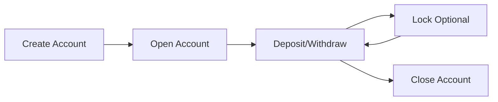

## Introduction

The Savings API provides comprehensive functionality for managing savings products, accounts, and transactions within OpenCBS Cloud. This API enables financial institutions to create and manage savings products, open savings accounts for customers, and process deposits and withdrawals.

## Base URL

All Savings API endpoints are accessible under the base path:

```
/api/savings
/api/saving-products
/api/tills (for teller operations)
```

## Authentication

All endpoints require authentication via Bearer token. Include the token in the Authorization header:

```bash
Authorization: Bearer YOUR_ACCESS_TOKEN
```

## Common Concepts

### Savings Lifecycle

A savings account progresses through the following states:

1. **Pending** - Account created but not yet opened
2. **Active** - Account opened and accepting transactions
3. **Locked** - Account temporarily locked from transactions
4. **Closed** - Account permanently closed

### Account Operations Flow



## Key Features

### Savings Products

- Define product templates with interest rates, fees, and transaction limits
- Configure minimum and maximum amounts for deposits and withdrawals
- Set up interest accrual and posting frequencies
- Manage product availability and status

### Savings Accounts

- Create accounts based on savings products
- Link accounts to customer profiles
- Assign savings officers for account management
- Track account balances and accrued interest

### Transactions

- **Deposits** - Add funds to savings accounts
- **Withdrawals** - Remove funds from savings accounts
- **Interest Accrual** - Automatically calculate and post interest
- **Fees** - Apply entry, management, deposit, withdrawal, and close fees

### Teller Operations

- Process deposits and withdrawals through teller tills
- Track cash movements and balances
- Integrate with accounting system

## Common Patterns

### Creating and Opening a Savings Account

```json
// 1. Create the account
POST /api/savings
{
  "profileId": 123,
  "savingProductId": 5,
  "savingOfficerId": 10,
  "interestRate": 3.5,
  "openDate": "2024-01-15T09:00:00"
}

// 2. Open the account with initial deposit
POST /api/savings/{id}/open?initialAmount=500.00
```

### Processing Transactions

```json
// Deposit funds
POST /api/savings/{id}/deposit?amount=200.00&date=2024-01-20T10:30:00

// Withdraw funds
POST /api/savings/{id}/withdraw?amount=100.00&date=2024-01-21T14:15:00
```

### Retrieving Account Information

```json
// Get account details with balance
GET /api/savings/{id}

// Get accounting entries
GET /api/savings/{id}/entries?page=0&size=20
```

## Permissions

The Savings API uses fine-grained permissions for access control:

| Permission | Description |
|------------|-------------|
| `SAVINGS_CREATE` | Create new savings accounts |
| `SAVINGS_UPDATE` | Update savings account details |
| `SAVING_OPEN` | Open pending savings accounts |
| `SAVING_CLOSE` | Close active savings accounts |
| `SAVING_DEPOSIT` | Process deposits |
| `SAVING_WITHDRAW` | Process withdrawals |
| `SAVING_LOCK` | Lock/unlock accounts |
| `GET_SAVINGS` | View savings accounts |
| `ACTUALIZE_SAVING` | Run interest accrual process |
| `MAKER_FOR_SAVING_PRODUCT` | Create/edit savings products |

## Error Handling

The API returns standard HTTP status codes:

- `200 OK` - Request successful
- `400 Bad Request` - Validation error (insufficient balance, invalid amount, etc.)
- `401 Unauthorized` - Missing or invalid authentication
- `403 Forbidden` - Missing required permission
- `404 Not Found` - Savings account or product not found
- `500 Internal Server Error` - Server error

Error responses include detailed messages:

```json
{
  "error": "INSUFFICIENT_BALANCE",
  "message": "Withdrawal amount exceeds available balance",
  "timestamp": "2024-01-20T10:30:00Z"
}
```

## Pagination

List endpoints support pagination using standard parameters:

- `page` - Page number (0-indexed)
- `size` - Number of items per page
- `sort` - Sort field and direction (e.g., `openDate,desc`)

Example:

```bash
GET /api/savings?page=0&size=20&sort=openDate,desc
```

Response includes pagination metadata:

```json
{
  "content": [...],
  "totalElements": 150,
  "totalPages": 8,
  "size": 20,
  "number": 0
}
```

## Date and Time Formats

The API uses ISO 8601 formats:

- **Date only**: `yyyy-MM-dd` (e.g., `2024-01-20`)
- **Date and time**: `yyyy-MM-dd'T'HH:mm:ss` (e.g., `2024-01-20T10:30:00`)

All timestamps are in the institution's configured timezone.

## Maker-Checker Workflow

Savings product creation and updates follow a maker-checker approval process:

1. Maker creates/updates product → Returns `RequestDto` with request ID
2. Request enters pending approval state
3. Checker reviews and approves/rejects the request
4. On approval, product becomes active

This ensures proper controls for product configuration changes.

## Next Steps

<CardGroup cols={2}>
  <Card title="Savings Products" icon="box" href="./products">
    Define and manage savings product templates
  </Card>
  <Card title="Savings Accounts" icon="piggy-bank" href="./accounts">
    Create and manage customer savings accounts
  </Card>
  <Card title="Transactions" icon="exchange" href="./transactions">
    Process deposits and withdrawals
  </Card>
</CardGroup>
