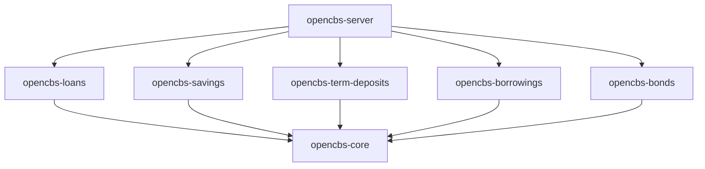

OpenCBS Cloud is built as a modular microfinance management system with a clear separation between backend services and frontend application. The architecture follows a multi-tier design pattern optimized for scalability and maintainability.

## Architecture Overview

<CardGroup cols={2}>
  <Card title="Backend Layer" icon="server">
    Spring Boot-based modular architecture with PostgreSQL database
  </Card>
  <Card title="Frontend Layer" icon="browser">
    Angular single-page application with reactive state management
  </Card>
  <Card title="Database Layer" icon="database">
    PostgreSQL with Flyway migrations and Hibernate ORM
  </Card>
  <Card title="Security Layer" icon="shield">
    JWT-based authentication with role-based access control
  </Card>
</CardGroup>

## Backend Architecture

### Technology Stack

The backend is built on **Spring Boot 1.5.4** and follows a modular Maven project structure. Each module is independently compilable while sharing common dependencies through the parent POM.

<Info>
The main server module (`opencbs-server`) aggregates all feature modules into a single deployable application.
</Info>

### Core Technologies

- **Spring Framework 5.1.7**: Core dependency injection and application context
- **Spring Boot**: Auto-configuration and embedded server
- **Spring Data JPA**: Data access layer with QueryDSL support
- **Hibernate 5.4.1** with Envers: ORM and audit trail
- **Flyway 4.0.3**: Database migration management
- **PostgreSQL 42.2.2**: Primary database
- **Lombok**: Reduces boilerplate code
- **MapStruct 1.4.2**: Object mapping between DTOs and entities

### Module Structure

```java
opencbs-cloud/
├── opencbs-core           // Foundation module
├── opencbs-loans          // Loan management
├── opencbs-savings        // Savings accounts
├── opencbs-term-deposits  // Fixed term deposits
├── opencbs-borrowings     // Institutional borrowing
├── opencbs-bonds          // Bond management
├── opencbs-server         // Main application
└── opencbs-spring-boot-starter // Shared configuration
```

### Dependency Hierarchy



All feature modules depend on `opencbs-core`, which provides:
- Domain entities (Profile, Branch, User)
- Accounting framework
- Security infrastructure
- Common services and utilities
- Custom field system

## Backend Package Structure

### Domain Layer

Domain classes use JPA annotations and follow the entity-repository-service pattern:

```java
package com.opencbs.core.domain.profiles;

@Entity
@Table(name = "profiles")
@Inheritance(strategy = InheritanceType.SINGLE_TABLE)
@DiscriminatorColumn(name = "[type]", discriminatorType = DiscriminatorType.STRING)
public class Profile extends CreationInfoEntity {
    
    @Column(name = "[name]", nullable = false)
    private String name;
    
    @Enumerated(EnumType.STRING)
    @Column(name = "status", nullable = false)
    private EntityStatus status;
    
    @ManyToOne
    @JoinColumn(name = "branch_id", nullable = false)
    private Branch branch;
}
```

<Note>
OpenCBS uses Hibernate Envers for automatic audit trails. The `@Audited` annotation enables complete change history tracking.
</Note>

### Service Layer

Services are annotated with `@Service` and use Spring's transaction management:

```java
package com.opencbs.core.services;

@Service
public class BranchService {
    private final BranchRepository branchRepository;
    
    @Transactional
    public Branch create(Branch branch) {
        this.updateBranchCustomFields(branch);
        branch.setId(null);
        return this.branchRepository.save(branch);
    }
}
```

### Controller Layer

REST controllers expose endpoints with Swagger documentation:

```java
@RestController
@RequestMapping(value = "/api/branches")
public class BranchController extends BaseController {
    
    @GetMapping
    public Page<BranchDto> get(Pageable pageable) {
        return branchService.findAll(pageable)
            .map(branchMapper::toDto);
    }
}
```

### Repository Layer

Repositories extend Spring Data JPA interfaces with QueryDSL support:

```java
public interface BranchRepository extends 
    JpaRepository<Branch, Long>,
    QueryDslPredicateExecutor<Branch> {
    
    Optional<Branch> findByName(String name);
    
    @Query("select b from Branch b where lower(b.name) like %:search%")
    Page<Branch> getBySearchPattern(Pageable pageable, @Param("search") String search);
}
```

## Frontend Architecture

### Technology Stack

The frontend is built with **Angular** using TypeScript and follows a container/component architecture pattern.

**Core Dependencies:**
- **Angular**: Component-based UI framework
- **NgRx**: State management with Redux pattern
- **RxJS**: Reactive programming with observables
- **Angular Material**: UI component library

### Application Structure

```typescript
client/src/app/
├── core/                  // Core services and guards
│   ├── services/         // HTTP clients and utilities
│   ├── guards/           // Route guards
│   ├── models/           // TypeScript interfaces
│   └── store/            // NgRx store configuration
├── containers/           // Feature modules
│   ├── profile/         // Profile management
│   ├── loan/            // Loan operations
│   ├── savings/         // Savings accounts
│   ├── configuration/   // System configuration
│   └── teller-management/ // Teller operations
└── shared/              // Shared components and utilities
```

### State Management

OpenCBS uses NgRx for centralized state management:

```typescript
// Core reducer
export function coreReducer(state = initialState, action: CoreActions) {
  switch (action.type) {
    case CoreActionTypes.LOAD_PROFILE:
      return { ...state, loading: true };
    case CoreActionTypes.LOAD_PROFILE_SUCCESS:
      return { ...state, profile: action.payload, loading: false };
    default:
      return state;
  }
}
```

### Service Layer

Angular services handle HTTP communication:

```typescript
@Injectable()
export class ProfileAccountsService {
  constructor(private httpClient: HttpClient) {}
  
  getProfileAccounts(profileId: number): Observable<Account[]> {
    return this.httpClient.get<Account[]>(
      `/api/profiles/${profileId}/accounts`
    );
  }
}
```

## Database Architecture

### Database Technology

OpenCBS uses **PostgreSQL** as its primary database with the following design principles:

- **Normalized schema** with foreign key constraints
- **Audit tables** automatically managed by Hibernate Envers
- **Versioned migrations** using Flyway
- **Custom field tables** for extensible entity properties

### Schema Organization

<Accordion title="Core Tables">
- `profiles`: Client profiles (persons, groups, companies)
- `branches`: Branch information
- `users`: System users with authentication
- `roles`: User roles and permissions
- `accounts`: Chart of accounts
</Accordion>

<Accordion title="Product Tables">
- `loans`: Active loan contracts
- `loan_products`: Loan product definitions
- `savings`: Savings accounts
- `saving_products`: Savings product definitions
- `term_deposits`: Fixed term deposit accounts
- `borrowings`: Institutional borrowing records
</Accordion>

<Accordion title="Transaction Tables">
- `accounting_entries`: All financial transactions
- `loan_events`: Loan lifecycle events (disbursement, repayment)
- `saving_postings`: Savings account transactions
- `loan_installments`: Loan repayment schedule
</Accordion>

<Accordion title="Configuration Tables">
- `global_settings`: System-wide configuration
- `custom_fields`: Dynamic field definitions
- `custom_field_values`: Instance-specific custom data
- `holidays`: Business calendar
</Accordion>

### Entity Relationships

The database follows a hierarchical profile model:

```sql
-- Single Table Inheritance for profiles
CREATE TABLE profiles (
    id BIGSERIAL PRIMARY KEY,
    type VARCHAR(20) NOT NULL, -- PERSON, GROUP, COMPANY
    name VARCHAR(255) NOT NULL,
    status VARCHAR(20) NOT NULL,
    branch_id BIGINT NOT NULL REFERENCES branches(id),
    created_at TIMESTAMP,
    created_by_id BIGINT REFERENCES users(id)
);

-- Loans reference profiles
CREATE TABLE loans (
    id BIGSERIAL PRIMARY KEY,
    profile_id BIGINT NOT NULL REFERENCES profiles(id),
    loan_product_id BIGINT NOT NULL REFERENCES loan_products(id),
    amount NUMERIC(14,2),
    interest_rate NUMERIC(8,4),
    status VARCHAR(20)
);
```

### Migration Management

Flyway migrations are organized by module:

```
opencbs-core/src/main/resources/db/migration/
├── V1__initial_schema.sql
├── V2__add_custom_fields.sql
└── V3__add_audit_tables.sql

opencbs-loans/src/main/resources/db/migration/
├── V100__create_loans.sql
├── V101__add_loan_events.sql
└── V102__add_guarantors.sql
```

<Note>
Each module maintains its own migration version range to prevent conflicts during deployment.
</Note>

## Security Architecture

### Authentication Flow

1. Client sends credentials to `/api/auth/login`
2. Server validates against database
3. JWT token generated with user claims
4. Token returned to client
5. Client includes token in `Authorization` header
6. Server validates token on each request

### JWT Token Structure

```json
{
  "sub": "username",
  "roles": ["ROLE_LOAN_OFFICER", "ROLE_TELLER"],
  "branch_id": 1,
  "exp": 1679500000
}
```

### Authorization

Role-based access control is implemented using Spring Security:

```java
@Configuration
@EnableWebSecurity
public class SecurityConfig extends WebSecurityConfigurerAdapter {
    
    @Override
    protected void configure(HttpSecurity http) throws Exception {
        http.authorizeRequests()
            .antMatchers("/api/loans/**").hasRole("LOAN_OFFICER")
            .antMatchers("/api/teller/**").hasRole("TELLER")
            .anyRequest().authenticated();
    }
}
```

## Integration Points

### REST API

All backend services expose RESTful APIs:

- **Base URL**: `/api/`
- **Format**: JSON
- **Authentication**: JWT Bearer token
- **Documentation**: Swagger UI at `/swagger-ui.html`

### Reporting Integration

OpenCBS uses **JasperReports 6.10.0** for report generation:

```java
@Service
public class ReportService {
    public byte[] generateLoanReport(Long loanId) {
        Map<String, Object> parameters = new HashMap<>();
        parameters.put("loanId", loanId);
        
        JasperPrint print = JasperFillManager.fillReport(
            jasperReport, parameters, dataSource.getConnection()
        );
        
        return JasperExportManager.exportReportToPdf(print);
    }
}
```

## Deployment Architecture

The application is packaged as a single executable JAR:

```bash
# Build process
mvn clean package

# Outputs
opencbs-server/target/opencbs-server-{version}.jar
```

The JAR includes:
- Embedded Tomcat server
- Compiled Angular frontend (served from `/static`)
- All module dependencies
- Database migration scripts

<Info>
The frontend is built during Maven compilation and bundled into the server JAR, creating a single deployment artifact.
</Info>
