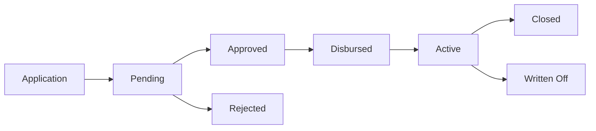

OpenCBS Cloud is architected as a collection of independent but interconnected Maven modules. Each module handles a specific domain of microfinance operations while sharing common infrastructure from the core module.

## Module Overview

<CardGroup cols={2}>
  <Card title="opencbs-core" icon="cube">
    Foundation module with shared entities, services, and infrastructure
  </Card>
  <Card title="opencbs-loans" icon="hand-holding-dollar">
    Complete loan lifecycle management from application to closure
  </Card>
  <Card title="opencbs-savings" icon="piggy-bank">
    Savings account operations with interest accrual and transactions
  </Card>
  <Card title="opencbs-term-deposits" icon="landmark">
    Fixed-term deposit products with maturity handling
  </Card>
  <Card title="opencbs-borrowings" icon="building-columns">
    Institutional borrowing and liability management
  </Card>
  <Card title="opencbs-bonds" icon="scroll">
    Bond issuance and management
  </Card>
</CardGroup>

## opencbs-core

The foundation module that all other modules depend on. It provides the essential building blocks for the entire system.

### Key Responsibilities

- **Profile Management**: Client profiles (persons, groups, companies)
- **Branch Management**: Multi-branch operations and hierarchy
- **User Management**: Authentication, authorization, and user accounts
- **Accounting Framework**: Chart of accounts and double-entry bookkeeping
- **Custom Fields**: Extensible entity properties
- **Security**: JWT authentication and role-based access control
- **Audit Trail**: Automatic change tracking with Hibernate Envers
- **Configuration**: Global settings and system parameters

### Module Configuration

```xml
<groupId>com.opencbs</groupId>
<artifactId>opencbs-core</artifactId>
<version>0.0.1-SNAPSHOT</version>
<packaging>jar</packaging>
```

### Core Domain Entities

<Accordion title="Profile Entities">

The profile system uses **single-table inheritance** to support different client types:

```java
package com.opencbs.core.domain.profiles;

@Entity
@Table(name = "profiles")
@Inheritance(strategy = InheritanceType.SINGLE_TABLE)
@DiscriminatorColumn(name = "[type]", discriminatorType = DiscriminatorType.STRING)
public class Profile extends CreationInfoEntity {
    
    @Column(name = "[type]", nullable = false)
    private String type;
    
    @Column(name = "[name]", nullable = false)
    private String name;
    
    @Enumerated(EnumType.STRING)
    @Column(name = "status", nullable = false)
    private EntityStatus status;
    
    @ManyToOne
    @JoinColumn(name = "branch_id", nullable = false)
    private Branch branch;
    
    @ManyToMany
    @JoinTable(name = "profiles_accounts")
    private Set<Account> currentAccounts = new HashSet<>();
}
```

**Profile Types:**
- `Person`: Individual clients
- `Group`: Solidarity groups or lending circles
- `Company`: Corporate/business entities

</Accordion>

<Accordion title="Branch Entity">

Branches support multi-location operations:

```java
package com.opencbs.core.domain;

@Entity
@Table(name = "branches")
public class Branch extends NamedBaseEntity {
    
    @OneToMany(mappedBy = "owner", cascade = {CascadeType.PERSIST, CascadeType.MERGE})
    private List<BranchCustomFieldValue> customFieldValues;
    
    @Override
    public String toString() {
        return this.getName();
    }
}
```

Key features:
- Custom field support for branch-specific data
- Referenced by profiles, users, and accounts
- Enables branch-level reporting and permissions

</Accordion>

<Accordion title="Account Entity">

The accounting module implements a hierarchical chart of accounts:

```java
package com.opencbs.core.accounting.domain;

@Entity
@Table(name = "accounts")
@Audited
public class Account extends NamedBaseEntity {
    
    @Column(name = "number", nullable = false)
    private String number;
    
    @Column(name = "is_debit", nullable = false)
    private Boolean isDebit;
    
    @Column(name = "lft")
    private Integer lft;  // Nested set left boundary
    
    @Column(name = "rgt")
    private Integer rgt;  // Nested set right boundary
    
    @ManyToOne
    @JoinColumn(name = "parent_id")
    private Account parent;
    
    @ManyToOne
    @JoinColumn(name = "branch_id")
    private Branch branch;
    
    @ManyToOne
    @JoinColumn(name = "currency_id")
    private Currency currency;
    
    @Column(name = "type")
    private AccountType type;
}
```

The nested set model (lft/rgt) enables efficient hierarchical queries.

</Accordion>

### Core Services

```java
// Branch management
com.opencbs.core.services.BranchService

// Profile operations
com.opencbs.core.services.ProfileService
com.opencbs.core.services.PersonService
com.opencbs.core.services.CompanyService
com.opencbs.core.services.GroupService

// Accounting
com.opencbs.core.accounting.services.AccountService
com.opencbs.core.accounting.services.AccountingEntryService

// Security
com.opencbs.core.security.services.AuthenticationService
com.opencbs.core.services.UserService
```

### Key Features

<CardGroup cols={2}>
  <Card title="Custom Fields" icon="sliders">
    Dynamic schema extension without database migrations
  </Card>
  <Card title="Audit Trail" icon="clock-rotate-left">
    Complete history of all entity changes via Hibernate Envers
  </Card>
  <Card title="Multi-Currency" icon="coins">
    Support for multiple currencies and exchange rates
  </Card>
  <Card title="Multi-Branch" icon="code-branch">
    Branch-aware entities and operations
  </Card>
</CardGroup>

## opencbs-loans

Comprehensive loan management module supporting the complete loan lifecycle.

### Module Configuration

```xml
<groupId>com.opencbs</groupId>
<artifactId>opencbs-loans</artifactId>
<version>0.0.1-SNAPSHOT</version>

<dependencies>
    <dependency>
        <groupId>com.opencbs</groupId>
        <artifactId>opencbs-core</artifactId>
        <version>${opencbs.version}</version>
    </dependency>
</dependencies>
```

### Domain Model

<Accordion title="Loan Entity">

```java
package com.opencbs.loans.domain;

@Entity
@Table(name = "loans")
public class Loan extends LoanBaseEntity {
    
    @Enumerated(EnumType.STRING)
    @Column(name = "status", nullable = false)
    private LoanStatus status = LoanStatus.ACTIVE;
    
    @OneToOne(fetch = FetchType.LAZY)
    @JoinColumn(name = "loan_application_id")
    private LoanApplication loanApplication;
    
    @ManyToOne(fetch = FetchType.LAZY)
    @JoinColumn(name = "profile_id", nullable = false)
    private Profile profile;
    
    @OneToMany(mappedBy = "loan")
    List<LoanAccount> loanAccountList;
    
    @OneToMany(mappedBy = "loan")
    private List<LoanPenaltyAccount> loanPenaltyAccountList;
    
    @Column(name = "schedule_manual_edited", nullable = false)
    private Boolean scheduleManualEdited = Boolean.FALSE;
    
    @Column(name = "schedule_manual_edited_at")
    private LocalDateTime scheduleManualEditedAt;
    
    @ManyToOne(fetch = FetchType.LAZY)
    @JoinColumn(name = "schedule_manual_edited_by_id")
    private User scheduleManualEditedBy;
}
```

</Accordion>

<Accordion title="Loan Application">

```java
package com.opencbs.loans.domain;

@Entity
@Table(name = "loan_applications")
public class LoanApplication extends LoanBaseEntity {
    
    @ManyToOne
    @JoinColumn(name = "profile_id", nullable = false)
    private Profile profile;
    
    @ManyToOne
    @JoinColumn(name = "loan_product_id")
    private LoanProduct loanProduct;
    
    @OneToMany(mappedBy = "loanApplication")
    private List<LoanApplicationEntryFee> entryFees;
    
    @OneToMany(mappedBy = "loanApplication")
    private List<Collateral> collaterals;
    
    @OneToMany(mappedBy = "loanApplication")
    private List<Guarantor> guarantors;
}
```

</Accordion>

### Loan Lifecycle



**Statuses:**
- `PENDING`: Initial application state
- `APPROVED`: Credit committee approval
- `DISBURSED`: Funds released to client
- `ACTIVE`: Repayment in progress
- `CLOSED`: Fully repaid
- `WRITTEN_OFF`: Non-performing loan written off
- `REJECTED`: Application declined

### Key Features

<Info>
The loan module supports flexible repayment schedules, early repayment, partial payments, and automatic penalty calculation.
</Info>

- **Loan Products**: Configurable loan templates with interest rates, terms, fees
- **Installment Calculation**: Multiple amortization methods (annuity, declining balance)
- **Collateral Management**: Track security for loans
- **Guarantors**: Multiple guarantor support
- **Repayment Events**: Track disbursements, repayments, write-offs
- **Penalty Management**: Automatic late fee calculation
- **Reschedule**: Modify repayment schedule for active loans
- **Group Loans**: Support for group lending methodologies

### Package Structure

```
com.opencbs.loans/
├── domain/              // Entities
├── services/           // Business logic
├── repositories/       // Data access
├── controllers/        // REST endpoints
├── dto/               // Data transfer objects
├── validators/        // Business rule validation
└── dayclosure/        // End-of-day processing
```

## opencbs-savings

Manages savings accounts with interest calculation and transaction processing.

### Module Configuration

```xml
<groupId>com.opencbs</groupId>
<artifactId>opencbs-savings</artifactId>
<version>0.0.1-SNAPSHOT</version>

<dependencies>
    <dependency>
        <groupId>com.opencbs</groupId>
        <artifactId>opencbs-core</artifactId>
        <version>${opencbs.version}</version>
    </dependency>
</dependencies>
```

### Domain Model

<Accordion title="Saving Entity">

```java
package com.opencbs.savings.domain;

@Entity
@Table(name = "savings")
public class Saving extends Contract {
    
    @Column(name = "code")
    private String code;
    
    @ManyToOne(fetch = FetchType.LAZY)
    @JoinColumn(name = "profile_id", nullable = false)
    private Profile profile;
    
    @ManyToOne(fetch = FetchType.LAZY)
    @JoinColumn(name = "saving_product_id", nullable = false)
    private SavingProduct product;
    
    @Column(name = "interest_rate", nullable = false)
    private BigDecimal interestRate;
    
    @Enumerated(EnumType.STRING)
    @Column(name = "interest_accrual_frequency")
    private Frequency interestAccrualFrequency;
    
    @Enumerated(EnumType.STRING)
    @Column(name = "interest_posting_frequency")
    private Frequency interestPostingFrequency;
    
    @Column(name = "capitalized", nullable = false)
    private boolean capitalized;
    
    // Deposit parameters
    @Column(name = "deposit_amount_min")
    private BigDecimal depositAmountMin;
    
    @Column(name = "deposit_amount_max")
    private BigDecimal depositAmountMax;
    
    @Column(name = "deposit_fee_rate")
    private BigDecimal depositFeeRate;
    
    // Withdrawal parameters
    @Column(name = "withdrawal_amount_min")
    private BigDecimal withdrawalAmountMin;
    
    @Column(name = "withdrawal_amount_max")
    private BigDecimal withdrawalAmountMax;
    
    @Column(name = "withdrawal_fee_rate")
    private BigDecimal withdrawalFeeRate;
}
```

</Accordion>

### Transaction Types

- **Deposits**: Cash deposits with optional fees
- **Withdrawals**: Cash withdrawals with limits and fees
- **Interest Accrual**: Periodic interest calculation
- **Interest Posting**: Transfer accrued interest to account balance
- **Management Fees**: Periodic account maintenance charges

### Interest Calculation

Savings supports multiple interest calculation frequencies:

```java
public enum Frequency {
    DAILY,
    WEEKLY,
    MONTHLY,
    QUARTERLY,
    ANNUALLY
}
```

Interest can be:
- **Accrued** but not posted (tracked separately)
- **Posted** to account balance (capitalized)

### Key Features

- **Savings Products**: Define product templates with interest rates and fees
- **Interest Accrual**: Automatic daily/monthly interest calculation
- **Transaction History**: Complete audit trail of all transactions
- **Balance Tracking**: Real-time balance with interest calculations
- **Minimum Balance**: Enforce minimum balance requirements
- **Withdrawal Limits**: Daily/monthly withdrawal restrictions
- **Dormancy Management**: Handle inactive accounts

## opencbs-term-deposits

Manages fixed-term deposit accounts with defined maturity dates.

### Domain Model

```java
package com.opencbs.termdeposite.domain;

@Entity
@Table(name = "term_deposits")
public class TermDeposit extends Contract {
    
    @ManyToOne
    @JoinColumn(name = "profile_id")
    private Profile profile;
    
    @ManyToOne
    @JoinColumn(name = "term_deposit_product_id")
    private TermDepositProduct product;
    
    @Column(name = "initial_amount")
    private BigDecimal initialAmount;
    
    @Column(name = "interest_rate")
    private BigDecimal interestRate;
    
    @Column(name = "open_date")
    private LocalDate openDate;
    
    @Column(name = "maturity_date")
    private LocalDate maturityDate;
    
    @Enumerated(EnumType.STRING)
    @Column(name = "status")
    private TermDepositStatus status;
}
```

### Maturity Actions

When a term deposit reaches maturity:
- **ROLL_OVER**: Automatically renew for another term
- **WITHDRAW_PRINCIPAL**: Return principal only
- **WITHDRAW_ALL**: Return principal and interest
- **TRANSFER**: Move to another account

### Key Features

- **Fixed Terms**: Define deposit duration (3 months, 6 months, 1 year, etc.)
- **Interest Rates**: Higher rates for longer terms
- **Early Withdrawal**: Optional with penalty calculation
- **Maturity Processing**: Automatic handling at term end
- **Interest Accrual**: Daily accrual with posting at maturity
- **Renewals**: Automatic or manual renewal options

## opencbs-borrowings

Manages institutional borrowing and liabilities.

### Domain Model

```java
package com.opencbs.borrowings.domain;

@Entity
@Table(name = "borrowings")
public class Borrowing extends BorrowingBaseEntity {
    
    @ManyToOne
    @JoinColumn(name = "borrowing_product_id")
    private BorrowingProduct borrowingProduct;
    
    @Column(name = "amount")
    private BigDecimal amount;
    
    @Column(name = "interest_rate")
    private BigDecimal interestRate;
    
    @Column(name = "disbursement_date")
    private LocalDate disbursementDate;
    
    @Column(name = "maturity_date")
    private LocalDate maturityDate;
    
    @Enumerated(EnumType.STRING)
    @Column(name = "status")
    private BorrowingStatus status;
    
    @OneToMany(mappedBy = "borrowing")
    private List<BorrowingEvent> events;
}
```

### Use Cases

Borrowings represent funds the MFI borrows from:
- Commercial banks
- Central banks
- Development finance institutions
- Investors
- Other financial institutions

### Key Features

- **Borrowing Products**: Templates for different funding sources
- **Repayment Schedules**: Track principal and interest payments
- **Interest Accrual**: Automatic expense calculation
- **Multi-Currency**: Support foreign currency borrowing
- **Exchange Rate Tracking**: Handle currency gains/losses
- **Covenant Tracking**: Monitor loan covenants and conditions

## opencbs-bonds

Manages bond issuance and investor relations.

### Domain Model

```java
package com.opencbs.bonds.domain;

@Entity
@Table(name = "bonds")
public class Bond extends BaseEntity {
    
    @ManyToOne
    @JoinColumn(name = "bond_product_id")
    private BondProduct bondProduct;
    
    @ManyToOne
    @JoinColumn(name = "profile_id")
    private Profile profile;  // Bond holder
    
    @Column(name = "number_of_bonds")
    private Integer numberOfBonds;
    
    @Column(name = "bond_unit_amount")
    private BigDecimal bondUnitAmount;
    
    @Column(name = "interest_rate")
    private BigDecimal interestRate;
    
    @Column(name = "issue_date")
    private LocalDate issueDate;
    
    @Column(name = "maturity_date")
    private LocalDate maturityDate;
}
```

### Key Features

- **Bond Products**: Define bond series with terms and rates
- **Investor Management**: Track individual bond holders
- **Coupon Payments**: Periodic interest payments to investors
- **Maturity Processing**: Handle bond redemption
- **Interest Accrual**: Automatic interest expense calculation
- **Secondary Market**: Track bond transfers between investors

## opencbs-server

The main application module that aggregates all feature modules.

### Responsibilities

- **Application Entry Point**: Main Spring Boot application class
- **Dependency Aggregation**: Bundles all modules into deployable JAR
- **Frontend Integration**: Serves Angular application from `/static`
- **API Gateway**: Single entry point for all REST endpoints
- **Configuration**: Application-wide settings and properties

### Module Dependencies

```xml
<dependencies>
    <dependency>
        <groupId>com.opencbs</groupId>
        <artifactId>opencbs-loans</artifactId>
    </dependency>
    <dependency>
        <groupId>com.opencbs</groupId>
        <artifactId>opencbs-savings</artifactId>
    </dependency>
    <dependency>
        <groupId>com.opencbs</groupId>
        <artifactId>opencbs-term-deposits</artifactId>
    </dependency>
    <dependency>
        <groupId>com.opencbs</groupId>
        <artifactId>opencbs-borrowings</artifactId>
    </dependency>
</dependencies>
```

<Note>
The opencbs-server module has no business logic of its own—it purely orchestrates the other modules.
</Note>

## Module Communication

Modules communicate through:

1. **Shared Domain Entities**: Core entities like `Profile` and `Branch` are used across modules
2. **Service Dependencies**: Modules can inject services from opencbs-core
3. **Event System**: Spring's application events for cross-module notifications
4. **Database Constraints**: Foreign keys ensure referential integrity

### Example Cross-Module Usage

```java
package com.opencbs.loans.services;

@Service
public class LoanService {
    // Dependency on core module
    @Autowired
    private ProfileService profileService;
    
    @Autowired
    private AccountingEntryService accountingService;
    
    public Loan disburseLoan(Long loanId) {
        Loan loan = loanRepository.findOne(loanId);
        Profile profile = profileService.findOne(loan.getProfile().getId());
        
        // Create accounting entries using core service
        accountingService.createDisbursementEntries(loan);
        
        return loan;
    }
}
```

## Building and Packaging

Build all modules:

```bash
# From server directory
mvn clean install

# Build specific module
cd opencbs-loans
mvn clean install
```

The build process:
1. Compiles each module independently
2. Runs unit tests
3. Packages as JAR
4. Installs to local Maven repository
5. Server module bundles everything into executable JAR

<Info>
Module independence allows parallel development—teams can work on different modules without conflicts.
</Info>
